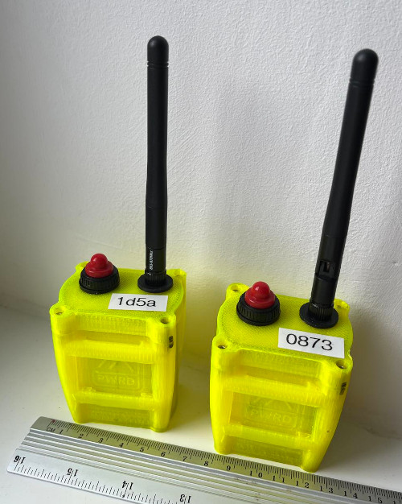
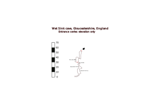
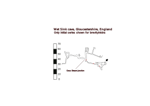
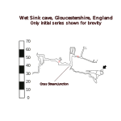
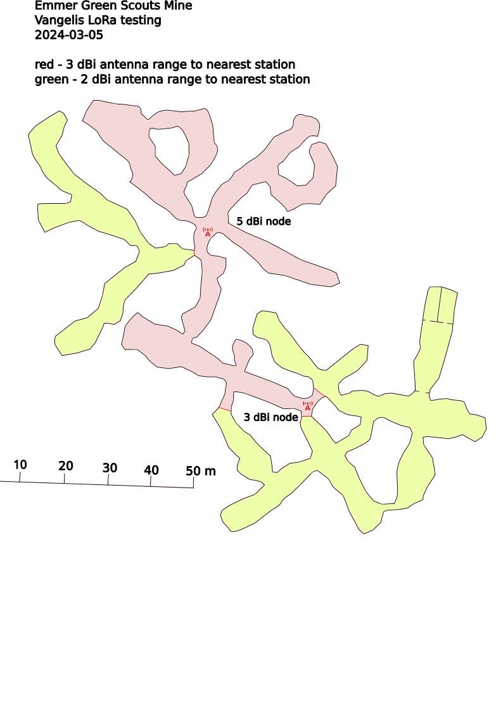
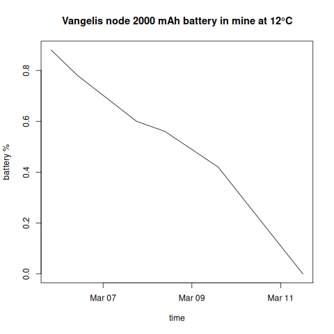
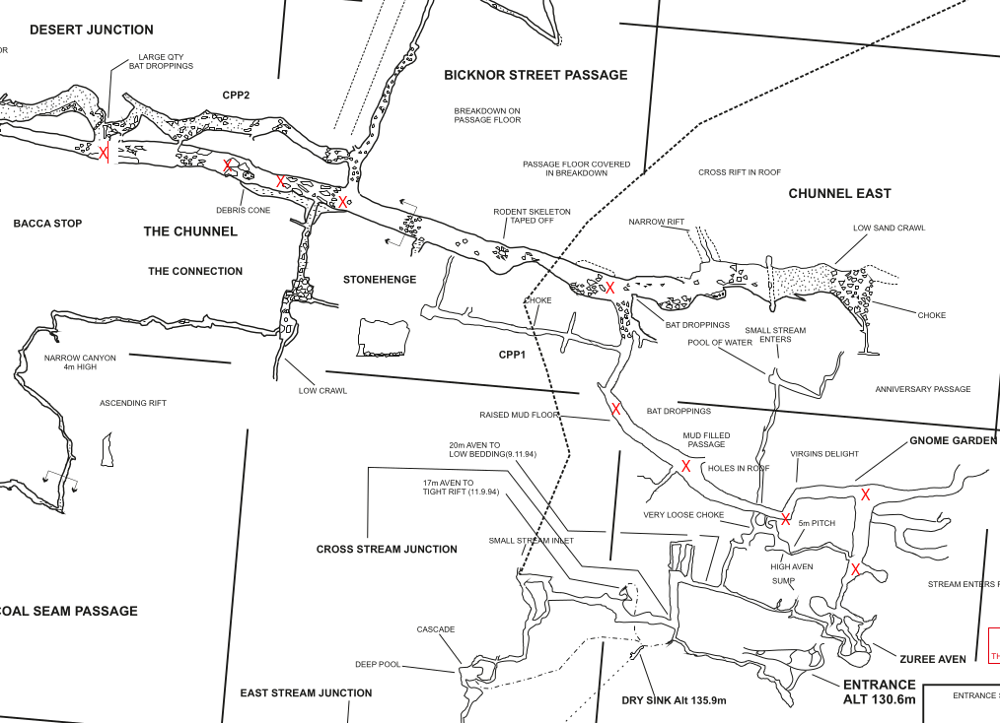
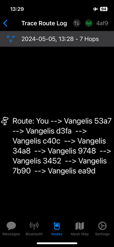

Long range, low power messaging system based on Meshtastic relays suitable for underground communications.


# Design principles
Natural caves are challenging as it comes to communications due to irregular cavity shapes, presence of water and general difficulty of installing any kind of equipment in an environment where everything has to be carried on human's back over hundreds of meters vertically. There are numerous existing solutions, each with its own challenges:

* Wired telephone is a reliable solution, however poses a significant investment due to the above challenges, plus it is easily damaged in confined passages, boulder chokes, gravel etc.
* [Through-the-earth radio communications](https://en.wikipedia.org/wiki/Through-the-earth_mine_communications) using very low radio frequencies (HeyPhone, Nikola, CaveLink) are the most popular _ad-hoc_ communications solution during cave rescue or expeditions . Obtaining a reliable link at depths below hundreds of meters however is a lottery as many factors from geology to weather impact attenuation even at  low frequencies.
* Underground communication links based on radio repeaters was discussed at least since 2014[^1]. _Sybet_ came up with industrial solution [SPELLCOM](https://sybet.eu/batnode/)  using radio repeaters to relay voice communications over underground cavities.


The **Vangelis** project expands on all of the above by using autonomous low-power repeaters for relaying text messages rather than voice over low-power radio transmission:

* Radio transmission using [LoRA](https://en.wikipedia.org/wiki/LoRa) modulation using [Meshtastic protocol](https://meshtastic.org/docs/introduction) for routing
* Low-power radio transmission with maximum 200 m line-of-sight range for underground nodes
* Long-term autonomous operations of each relay node
* Low weight and portability of the nodes
* Range of surface relays limited only by LoRa radio reach, practically up to a few kilometers in mountainous areas
* Consumer smartphones connecting over Bluetooth to relay nodes using [Meshtastic app](https://meshtastic.org/downloads/) to send and receive messages


# Hardware

The system is composed of two node types: surface and underground. Each node operates in router-client mode, which allows both client device (smartphone) connection over Bluetooth and message relaying to other nodes over LoRa.

* **surface node**
* **cave node** powered from a LiPo battery and intended to operate without recharging for the whole period of a cave operation

 and surface nodes (right)")

## Surface node

Relay node intended to be used outdoors and thus not subject to size and weight limitations. The prototype is powered from a 18650 cell with [PV charging](https://docs.google.com/document/d/12GIY24vLKLABg2RUTPP6yMzokr44GMzJOE4p7ngaCbI/edit#heading=h.9lmvuqjahqxl), equipped with a 3-5 dBi antenna. Typical usage scenario is to be installed at cave entrance and relay messages further to another such node at a base camp. The node can be equipped with a GPS receiver.

Bill of materials:

* [Clear Hinged Lid IP67 Waterproof ABS Electrical Enclosure Case junction box](https://www.ebay.co.uk/itm/304321459053)
* [WisBlock Meshtastic Starter Kit](https://store.rakwireless.com/products/wisblock-meshtastic-starter-kit)
* OLED Display [Solomon SSD1306 - RAK1921](https://store.rakwireless.com/products/rak1921-oled-display-panel)
* [RAKBox-B5 Transparent Acrylic Enclosure](https://store.rakwireless.com/products/rakbox-b5-transparent-acrylic-enclosure)
* [Outdoor LoRA antenna](https://store.rakwireless.com/collections/outdoor-antennas) any antenna can be used, two prototype nodes were built with 3 dBi and 5 dBi antennas
* 3D-printed antenna holder, STL for RAK [3dBi Fiberglass Antenna](https://store.rakwireless.com/products/3dbi-fiber-glass-antenna) or [5dBi Fiberglass Antenna](https://store.rakwireless.com/products/5dbi-fiber-glass-antenna-supports-863-870mhz) are available
* [5V  1.25W  250 mA photovoltaic panel](https://www.ebay.co.uk/itm/113383833070), 110mm x 69mm, 2.4mm

Notes:

* OLED display is optional. It's mostly useful when pairing smartphone with Meshtastic over Bluetooth using a random PIN code, but since these are impractical underground, the nodes are configured to use no PIN at all. Since it also displays last packet information etc it's a nice to have.
* Choice of the antenna is of paramount importance for outdoor LoRA range. Poor antenna will limit the range to tens or hundreds of meters at best, even in line of sight. With RAK 3-5 dBi antennas we easily get kilometers long range. It does not matter for underground nodes as their range is limited by rock anyway.

## Cave node

Durable, waterproof case made of 3D-printed plastic, indented to be operated in hostile environment and simplified operations. Prototype weight ~130 grams. The only user interface is the power button on the top, that is big enough to be operated in gloves. The WisBlock board has a green, blinking LED which is visible through the plastic case and serves as an indicator that the device is live and transmitting. The case has an USB-C port on the bottom that in normal conditions is closed with a rubber seal.

# Build

## Bill of materials

RAK Wireless parts:

* Use [this link](https://rakwireless.kckb.st/15fac583) - 5% for the project support
* `BYKKDT` at checkout - 3% discount
* `WELCOMEBACK10` at checkout - 10% discount

Order:

* [RAK WisBlock Mini Base Board RAK19003](https://store.rakwireless.com/products/wisblock-base-board-rak19003)
* [RAK LoRa Core Module RAK4631](https://store.rakwireless.com/products/nordic-nrf52840-ble-core-module-for-lorawan-with-lora-sx1262-rak4631-rak4631-c) (includes [BLE-PCB Bluetooth antenna](https://store.rakwireless.com/products/ble-pcb-antenna-5-5dbi) and [PCB LoRa antenna](https://store.rakwireless.com/products/pcb-antenna-for-lora))
* [RAK barometric pressure sensor RAK1902](https://store.rakwireless.com/products/rak1902-kps22hb-barometric-pressure-sensor)
* [IPEX to RP-SMA connector](https://store.rakwireless.com/products/ipex-to-sma-connector)
* [LoRa 2 dBi SubG antenna](https://store.rakwireless.com/products/lora-antenna)

The above set is a "safe default", sourced from a single supplier with predictable quality. RAK SubG antenna is not flexible which is a bit of disadvantage. There's quite a lot of LoRa antenna suppliers available on electronic stores but quality of most of them is unpredictable. These two can be considered as flexible alternatives to RAK SubG, but they will require slightly different assembly:

* Amazon UK: Flexible [IPEX-1 TX868-JZLW-15](https://www.amazon.co.uk/TX868-JZLW-15-Equipment-Logistics-Construction-Enthusiasts/dp/B0978Q7N7C/)
* Amazon DE: [FLEXI-SMA-868](https://www.amazon.de/FLEXI-SMA-868-Antennen-Geschirrantennen-RF-Antenne-Satelliten-Ausr%C3%BCstung/dp/B09HMMH8ZY)

3D-printed:

* [TacMesh Waterproof Enclosure](https://www.thingiverse.com/thing:5923930/) 3D printed from PLA, [assembly instructions](https://youtu.be/gpnivx2jVRk) (in German)

Assembly notes:

* Do not put too much resin at the USB port base as it will bond the middle insert and battery, making the electronics impossible to remove for repair or firmware upgrade; 1-2 ml is just enough
* Do not glue the battery to the internal insert. Use two-sided tape or leave it loose. The space is tight anyway, it holds on friction.
* 3D printer precision depends wildly on the model and printing speed - you will most likely find especially the M2.5 brass inserts too loose. Small file, sharp knife and sandpaper will come useful.
* LiPo batteries come with different plug sizes and polarization - please double check that battery red cable (+) is linked to the contact closer to the USB-C port on the WisBlock Base board.

Other parts:

* [M2.5×4×3.5 threaded brass inserts](https://www.amazon.co.uk/dp/B07SYP6PRJ)
* [Waterproof on-off switch](https://www.amazon.co.uk/dp/B0BKK4RXYX)
* [3.7V 2000 mAh LiPo battery](https://www.amazon.co.uk/dp/B08HD33ZKB)
* [Rubber washer 16x6x1.5 mm](https://www.amazon.co.uk/dp/B01N7WI68Z)
* [Rubber O-ring 49x45x2 mm](https://www.amazon.co.uk/dp/B0C1524ZMR)
* [USB-C male to female coupler](https://www.amazon.co.uk/dp/B0B18SLFD4)
* [Rubber USB-C plugs](https://www.ebay.co.uk/itm/144021649084)



# Flashing firmware

There's two firmwares now available for testing:

* Mainline Meshtastic firmware, which is stable and feature-rich but has the
  hop limit hardcoded to 7 nodes
* Vangelis firmware, which is experimantal but has the hop limit removed

**Note:** if you get weird errors, timeouts etc first check the USB cable connection, which may be especially likely if mud or dust get into your external USB port. Try to remove and reinsert the cable, blow with compressed air a few times. Last resort, you need to remove the board from the 3D printed case and it should always work.

## Flashing Meshtastic firmware

Make sure you have **the same version** on all devices. There are ocassional incompatibilities between even minor versions. I usually target for the latest _beta_ release. Generally, new releases ship many bugfixes so it's
worth keeping them up to date.

Connect your device over USB cable and use [Meshtastic Web Flasher](https://flasher.meshtastic.org) to download the right firmware UF2 file and, which is especially useful, switch the board into bootloader (DFU) mode. This saves you opening the case and pulling out the board only to press the reset button twice. Please note that if your board was already flashed with firmware <2.2, it won't work and you need to use the button.

When the board goes into DFU mode, it becomes visible as an USB storage device to the computer and you will see a new RAK4631 folder on your computer, where you simply copy the UF2 file. If you don't, power cycle, reconnect
and try the DFU mode again.

## Vangelish firmware

You can either:

* Clone the [vangelis-firmware](https://github.com/semper-ad-fundum/vangelis-firmware.git) and build using PlatformIO
* Download the built [UF2 firmware](https://github.com/semper-ad-fundum/vangelis-firmware/releases/tag/v1.0.0) and copy it to the device using the above instructions (not tested)

Command to flash firmware built using PlatformIO is:

```
platformio run --environment rak4631 --target upload
```
Advantage of PlatformIO is that it will put your firmware in DFU mode automatically.

# Configure

You can't configure a headless Meshtastic device over Bluetooth alone, so you will need the Python CLI or Web Client. See [Meshtastic initial configuration guide](https://meshtastic.org/docs/getting-started/initial-config/)
for overview of these options if you're new. At the end of the day, I find the CLI to be much more reliable
in terms of ensuring identical configuration across many devices.

Before doing anything else, you need to configure LoRA region - it has to match the hardware you ordered
and it determines parameters such as frequency, maximum power etc. See [LoRA configuration guide](https://meshtastic.org/docs/configuration/radio/lora/) for details.

```
meshtastic --set lora.region EU_868
```

I'm using the following series of CLI commands to ensure configuration is consistent across devices.
**Note:** the Meshtastic system has a lot of moving parts (both figuratively and literally) - the hardware,
charging module, serial port, USB drivers etc. Ocasionally things don't work on the first try - the
serial port doesn't come up, the board boots longer etc. Don't assume your CLI command worked on the first
try, in case of issues reconnect USB, power off/on, then verify config on the device. This will
help you avoid the frustration caused by devices "not seeing" each other due to mismatched configuration.

Remember that Meshtastic firmware will reboot after each `--set` command, which is why we
pipeline them in a single command line and use the `--begin-edit/--commit-edit` transaction.
As explained above, if the `--get` or `--info` command fails on timeout etc, the boards most likely hasn't booted
yet. Power cycle, reconnect cable, try again.

Here's the configuration commands I'm using, explanation of each option below:
```
meshtastic --begin-edit
meshtastic --set bluetooth.mode NO_PIN \
        --set lora.ignore_mqtt true \
        --set lora.hop_limit 7 \
        --set device.role ROUTER_CLIENT \
        --set telemetry.environment_measurement_enabled true \
        --set lora.override_duty_cycle	true \
        --set position.gps_enabled false \
        --set position.fixed_position false \
        --set lora.sx126x_rx_boosted_gain true \
        --set device.button_gpio 33 \
        --set device.rebroadcast_mode LOCAL_ONLY \
        --ch-set name "vangelis" --ch-set psk "base64:9Z0jb0WvHgZy1S45NS2okNU5bM0IRlMh7aYMe8C4g+E="  --ch-index 0 \
        --ch-set name "admin" --ch-set psk "base64:knz/eAAve3bM1nUgpI9D0ZKzQh0n1g2ULSjcYfsMvhY=" --ch-index 1 \
        --reset-nodedb
meshtastic --commit-edit
```
**Note:** The channel keys are just randomly generated using `--ch-set psk random` on one device, then read with `--info`
and reused for other devices.
You can use your own or just reuse these above. Their main purpose is not secrecy but radio separation
from the public mesh.

After these have been written, I wait 5 seconds and read the values from the device
to ensure that everything has been _actually_ written:

```
sleep 5
meshtastic --get bluetooth.mode \
        --get lora.ignore_mqtt \
        --get lora.hop_limit \
        --get device.role \
        --get telemetry.environment_measurement_enabled \
        --get lora.override_duty_cycle \
        --get position.gps_enabled \
        --get position.fixed_position \
        --get lora.sx126x_rx_boosted_gain \
        --get device.button_gpio \
        --get device.rebroadcast_mode
```

Unfortunately, there's no command to read channel configuration only, so you need to issue the `--info` command
and check at the bottom that 1) there's two channels, 2) channel `0` is _not_ set to `default` name and default `AQ`
key but to the values specified above. If this part hasn't been written, just repeat the `--ch-set` commands alone.

After you have a few nodes configured and powered on, worth checking if they see each other. It doesn't make sense to check
earlier than after ~5 minutes:

```
meshtastic --nodes
```

## Configuration options

Please note these settings are designed for **underground use cases only**. The are neither safe nor legal for surface use.

* `bluetooth.mode NO_PIN` — disables BLE pairing PIN. The default setting is random PIN, which you won't be able to see due without display. You can still see it using `--info` but it's not practical with a roaming user in a cave. With `NO_PIN` any phone can just connect to any device nearby.
* `lora.ignore_mqtt true` — disable public MQTT chatter just in case you manage to capture some external nodes
* `lora.hop_limit 7` — maximum Meshtastic hop limit
* `device.role ROUTER_CLIENT` — each node is a router which can be also connected as a client
* `telemetry.environment_measurement_enabled true` — do periodically send the barometric pressure and temperature measurements
* `lora.override_duty_cycle true` — **illegal on surface** but makes sense in a cave
* `position.gps_enabled false` — don't waste resources on sending and updating GPS position
* `position.fixed_position false` —  don't store and send any fixed position configured previously
* `lora.sx126x_rx_boosted_gain true` —  trade a bit of battery life for better reception
* `device.button_gpio 33` — fixes an issue where the board believes barometric sensor sends a `long button press` and shuts down
* `device.rebroadcast_mode LOCAL_ONLY` — don't forward traffic from other meshes

The folowing options create a new default channel (the mesh _must_ have one with index `0`) and
an [Admin channel](https://meshtastic.org/docs/configuration/remote-admin/) that allows you to reconfigure other nodes remotely.

* `--ch-set name "vangelis" --ch-set psk "base64:9Z0jb0WvHgZy1S45NS2okNU5bM0IRlMh7aYMe8C4g+E="  --ch-index 0`
* `--ch-set name "admin" --ch-set psk "base64:knz/eAAve3bM1nUgpI9D0ZKzQh0n1g2ULSjcYfsMvhY=" --ch-index 1`

Note the index, name and key _must_ be identical across all nodes for them to see each other.
If they don't, this is your first suspect — use `--info` to double-check if the settings are identical.


# Deployment in cave

When building the actual link in cave you need to find the right spot where the new node is placed as far as possible but
still visible by the previous one. If you place them too close, you'll need more nodes. If you place them too far, they
won't see each other.

The [Range Test Module](https://meshtastic.org/docs/configuration/module/range-test/) is one useful tool for that.
You configure the top (entrance) node as Range Test Sender, sending sequential numbers every 15 seconds:

```
meshtastic --set range_test.enabled true --set range_test.sender 15
```

Then you need to designate another node as the Range Test Receiver  — the range test messages are _forwarded_ by all nodes but only _visible_ on the designated one:

```
meshtastic --set range_test.enabled true
```
With the Receiver node and paired mobile in your pocket you just move down the cave as long as you hear beeps every 15 seconds.
When you no longer hear them, you just move back a bit to hear them again and you place another relay node there. Then you move forward with your Receiver node with you.

Sending periodic range test messages uses energy, so here's where the [Admin Channel](https://meshtastic.org/docs/configuration/remote-admin/) comes handy: you can _remotely_ disable the Range Test Module from your mobile when you reach the intended
destination, or you can increase or decrease the interval when needed.

Another useful test is to send a Meshtastic direct message to the surface node and wait for Acknowledgement to ensure
the whole link is working.

# Future improvements

## Firmware

The original Meshtastic firmware has a number of features that are great from usability point of view
but are disadvantages for the specific cave use cases:

* Limit of maximum 7 hops imposed by 3 bits hop counter in the wire protocol. Firmware recompilation
  is easy but the hop limit isn't just matter of increasing a variable, it would require changing the
  bit width in the actual protocol. What can be done in firmware is to disable the hop limit checks
  for Vangelis firmware, but this needs more testing.
* Meshtastic is a chatty ecosystem where nodes periodically send various metadata to discover and
  organize the mesh. For that reason the firmware also observes various hardcoded limits, for example
  limiting sending of any packets when duty cycle is exceeded and not sending _some_ packets when
  channel utilization exceeds arbitrary thresholds. One of the first features to be impacted by these
  limits is Range Test module, which is quite useful when building the initial cave link.

## Barometric altitude

As cave nodes are located through the cave, they have no means of determining their own location as GPS signal is unavailable. Barometric pressure sensor allows to [correlate the pressure](https://en.wikipedia.org/wiki/Barometric_formula) seen by a node with altitude above mean sea level ([AMSL](https://en.wikipedia.org/wiki/Height_above_mean_sea_level)) as long as at least one surface node is equipped with GPS receiver _and_ barometric pressure sensor. The surface node would then operate as the barometric/altitude reference for the whole network. With this improvement, the Meshtastic application would see the nodes identified by their depth rather than merely names, e.g.:

| Entrance pressure | Node pressure | Depth  |
|-------------------|---------------|--------|
| 1000 hPa          | 1000 hPa      | 0 m    |
|                   | 1010 hPa      | -87 m  |
|                   | 1030 hPa      | -259 m |
|                   | 1035 hPa      | -302 m |

Note that GPS is only required for absolute AMSL measurements, for relative depth only the barometric sensor is required. The
temperature, which is [another component](https://www.wolframalpha.com/input?i=barometric+formula&assumption=%7B%22C%22%2C+%22barometric+formula%22%7D+-%3E+%7B%22Formula%22%2C+%22dflt%22%7D&assumption=%7B%22FS%22%7D+-%3E+%7B%7B%22BarometricFormula%22%2C+%22h%22%7D%2C+%7B%22BarometricFormula%22%2C+%22p%22%7D%2C+%7B%22BarometricFormula%22%2C+%22p0%22%7D%2C+%7B%22BarometricFormula%22%2C+%22M%22%7D%2C+%7B%22BarometricFormula%22%2C+%22T%22%7D%7D&assumption=%7B%22F%22%2C+%22BarometricFormula%22%2C+%22M%22%7D+-%3E%2229+g%2Fmol%22&assumption=%7B%22F%22%2C+%22BarometricFormula%22%2C+%22T%22%7D+-%3E%22300+K%22&assumption=%7B%22F%22%2C+%22BarometricFormula%22%2C+%22p%22%7D+-%3E%221035+hPa%22&assumption=%22FSelect%22+-%3E+%7B%7B%22BarometricFormula%22%7D%2C+%22dflt%22%7D&assumption=%7B%22F%22%2C+%22BarometricFormula%22%2C+%22p0%22%7D+-%3E%221000+hPa%22) of the barometric formula is both measured by the sensor, and usually quite stable across cave.

## Wired communications

Long, tight crawls are especially challenging for connecting using relay nodes due to relatively short (~10 m max in our tests) radio range and high risk of the nodes being displaced or damaged by cavers moving with bags in confined space. In theory, the nodes could be also connected using a serial cable connected to the USB-C port, which could replace the radio link through the problematic tunnel.

The Meshtastic firmware currently supports [serial communications](https://meshtastic.org/docs/configuration/module/serial/) but not exactly for node-to-node links. The length of such a hypothetical link and how it would need to be powered is also unknown.

A fibre optic cable should be also possible.

# Testing

## Wet Sink testing

Initial testing in real-life conditions was performed with [GCRG](https://gcrg.org.uk) in [Wet Sink cave](https://en.wikipedia.org/wiki/Slaughter_Stream_Cave) which offers all typical karst cave features - pitches, chokes, tight squeezes, water.

1. One "surface" node was placed at the head of entrance pitch. Another one was carried down until signal was lost, which came out to be nearly at the bottom of the next pitch (Mouse pitch).
   This covered ~20 m vertically with a horizontal displacement of ~5 m in a choke in the middle.



2. Three "cave" nodes were used to create a link through a tight ~30 m long crawl joining the bottom of the Pen Pot pitch with Cross Stream Junction. The crawl is 30-40 cm high
   with numerous sharp turns on the way.



3. Two nodes were carried from Cross Stream Junction in opposite directions as long as the signal lasted. The devices were able to communicate through a rather spacious (2x3 m) tunnel
   with no line of sight over at least four sharp turns. The total walking distance covered was ~40 m.



4. Additional relay node was added right at the Cross Stream Junction. Mobile nodes were again carried in opposite directions. The total walking distance covered was ~70 m across the same sharp bends
   plus some smaller tunnel irregularities.


The testing was intentionally performed in confined parts of the cave to check the worst case scenario first and the above distances indicate performance of the system under such conditions.
In spacious caves, both horizontal and vertical, there's no reason why the links couldn't reach the usual surface line-of-sight range, that is up to 200 m in case of the 2 dBi antennas.

The above drawings are based on the 2004 survey drawn by Paul W. Taylor, simplified for readability.

## Emmer Green mine testing

Testing was performed in March 2024 in Emmer Green chalk mine
to which access was kindly provided by 89th Scouts Group. The
testing session had two objectives: range testing and battery life
in real-world mine conditions.

### Range testing

Range testing used the Range Test module which sends periodic messages
with sequentially increasing numbers (`seq 1`, `seq 2` etc). The module
was configured to send messages every 15 seconds. This makes the
testing procedure as simple as walking away from the last placed node
until notifications are heard for incoming messages. When they no longer
are, we mark end of range.

1. One node with 5 dBi antenna was placed at the bottom of the
   entrance shaft with range test mode enabled
2. Second node with 3 dBi antenna was moved in tunnels away from
   the entrance shaft.

**Result:** the 3 dBi node had stable connection in all mine tunnels
NW, NE, W and E from the pitch, marked in red colour on the map below.
In the S tunnel the range was ~70 m walking distance including one sharp
bend E through a lower entrance. The node was left under the
second capped mine shaft, as marked on the map.

3. Another mobile node with 2 dBi antenna was again being carried
   in the remaining tunnels.

**Result:** the 2 dBi mobile node had stable connection in all
mine tunnels, including two underground bunkers reinforced with
corrugated steel (Nissen huts), through numerous bends and squeezes.
The 2 dBi node range is marked with the pale green colour on the map.



### Battery life testing

One 2 dBi cave node was left at the bottom of the entrance shaft
and retrieved a week later. Remaining nodes were placed on the surface
to relay messages from the bottom to my house, which provided periodic
device status updates, including battery level and temperature.

At the end of the range testing the cave node was at 88% which
was the starting condition for the battery life test on 5 March. The temperature
reported by the device remained around 12°C through the whole test.

| Timestamp | Battery [%] |
| --------- | ----------- |
| 2024-03-05T19:54 | 88% |
| 2024-03-06T10:10 | 78% |
| 2024-03-07T18:02 | 60% |
| 2024-03-08T09:26 | 56% |
| 2024-03-09T14:12 | 42% |
| 2024-03-11T12:00 | 0% |

**Result:** the node worked stable for 6 days, reporting almost
linear battery deterioration over that period. The node sent the last
status message around noon on 11 March, reporting battery depleted
to zero.



### Wet Sink Chunnel testing

The second Wet Sink testing was conducted with 10 newly built cave nodes. We decided to start just before the Gnome Gardens, as the (mostly vertical) entrance series were covered previously. Ten nodes were placed in a chain ending on the Desert Junction, which is the typical Cave Link comms team location during rescue.

The lengths of legs expectedly varied depending on the passage profile and turns, usually ranging from 20-30 m and in the spacious Chunnel exceeding 60 m. Should we have taken nails or wood screws allowing to hang the nodes from the ceiling, the legs would be probably even longer because it was the floor in the Chunnel that was quite rocky and uneven.



With 10 nodes we faced the Meshtastic hard-coded limitation of maximum 7 hops between end nodes, so the end-to-end tests had to be for now limited to two segments of this length. The time for a message to traverse the whole link was several seconds.



Video from two locations has been recorded: https://www.youtube.com/watch?v=ZQZXCrsZBEA&t=205s

# Footnotes

[^1]: M. D. Bedford; G. A. Kennedy [Modeling Microwave Propagation in Natural Caves Passages](https://ieeexplore.ieee.org/abstract/document/6933914/),  IEEE Transactions on Antennas and Propagation, 2014
